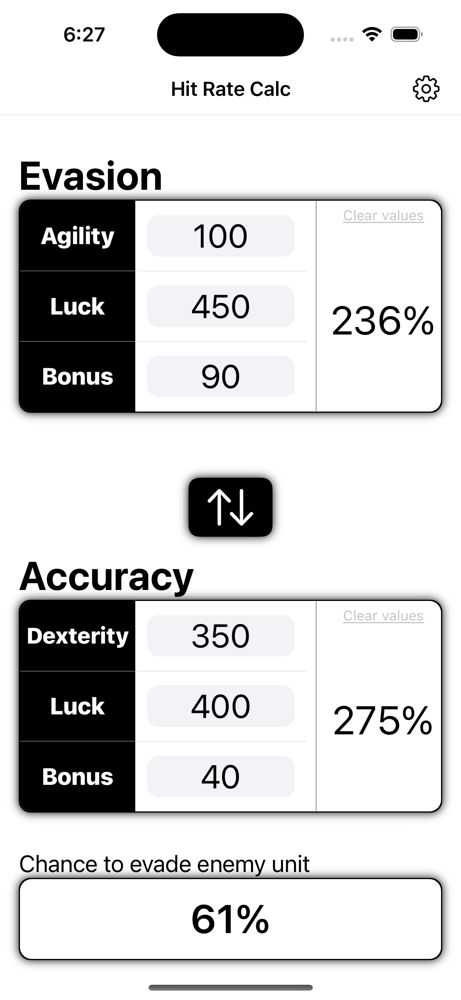
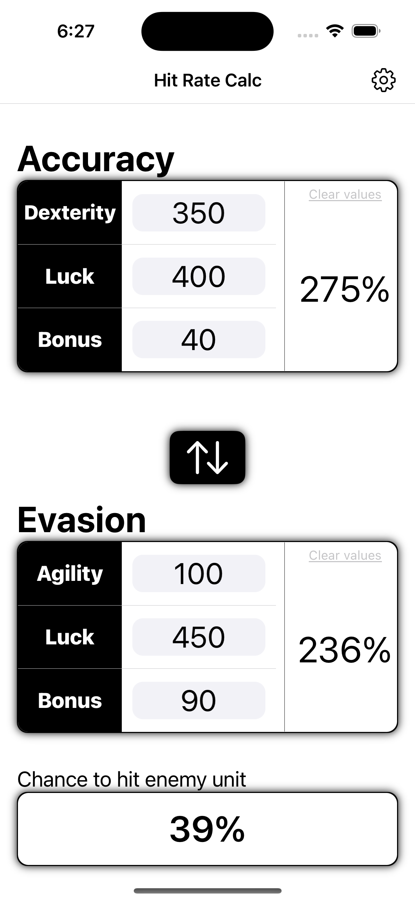

# HitRateCalc
HitRateCalc is an iOS app that helps players of the mobile game Final Fantasy Brave Exvius: War of the Visions determine the accuracy and evasion rates of their units. The app allows users to input dexterity, luck, and accuracy bonus values to calculate accuracy, and agility, luck, and evade bonus values to calculate evasion. The app then combines the two rates to display the final hit-rate, or the chance of evading an attack. This app is a useful tool for players looking to optimize their unit's performance in battle.

In Version 2, users have the ability to save a list of units, allowing them to easily switch between various units when checking hit-rates.

## Architecture
HitRateCalc was built using SwiftUI (iOS 16 minimum deployment), uses an 'MVVM' (ish) design pattern, and is separated into relatively distincy modules.

#### Main
Contains the App struct as well as any coordinator views. Files within this module control the flow of the app, thus have a high amount of depenencies.

#### UI
Contains all SwiftUI views as well as any ViewModifiers and extensions to View.

#### DataModel
This is what I call my 'View Models'. `HitRateDataModel` acts as a view model for the main view (`HitRateView`), `VisionDetailsDataModel` acts as viewModel for the details view, and the `SettingsDataModel` is for the settings view.

#### Logic
The star file of this app is `HitRateCalculator`. It is responsible for performing the calculations to determine accuracy/evasion rates. The logic used was derived from [this YouTube Video](https://www.youtube.com/watch?v=NamgdMLYpMI).

(NOTE: I have no affiliation with its creator, though I have to say I enjoy the content contained on that channel.)

The `VisionStoreAdapter` conforms to the `VisionStore` protocol and is a decorator used by the `VisionDetailsDataModel`, providing a way to skip data persistence if necessary without affecting the behavior of the DataModel. As a decorator, it also has a dependency on the VisionStore protocol, which at the moment is filled by the `SharedCoreDataManager`.

#### Model
The `Vision` model is used to represent the data required for a unit's name and stats. The actual stats are primitives, though they can be converted into a `VisionStat`, and enum that allows their hit-rate/evasion-rate to be easily displayed/calculated for either accuracy or evasion.

#### CoreData
The persistence layer. CoreData is accessed primarily by the `SharedCoreDataManager`, which conforms to the VisionStore protocol. `UnitListView` also depends on CoreData (it uses `@FetchRequest` property wrapper to easily display the list of saved units).

`UnitListView` is the only file outside of the Main module that has direct access to `SharedCoreDataManager`, though the reference could (and will be in future) be easily encapsulated to mitigate unneeded dependencies.

#### AdMob 
AppOpen ads are utilized in this app, controlled by the `AppOpenAdsManager` singleton. To prevent problems, the singleton is only accessed by files in the Main module.

#### Shared 
Any files that could possibily be shared across modules (or that I didn't find a good place for).

## Disclaimer
HitRateCalc is not affiliated with or endorsed by Square Enix or gumi Inc. Final Fantasy Brave Exvius: War of the Visions is a registered trademark of Square Enix.

## Contributions
Any contributions from the community is certainly welcome. If you have any features or bug fixes to suggest, please submit a pull request.

## Screenshots

   
   

## Download
HitRateCalc is available for download on the [AppStore](https://apps.apple.com/us/app/hitratecalc-for-ffbe-wotv/id6443476914).

## License
HitRateCalc is licensed under the MIT License.
